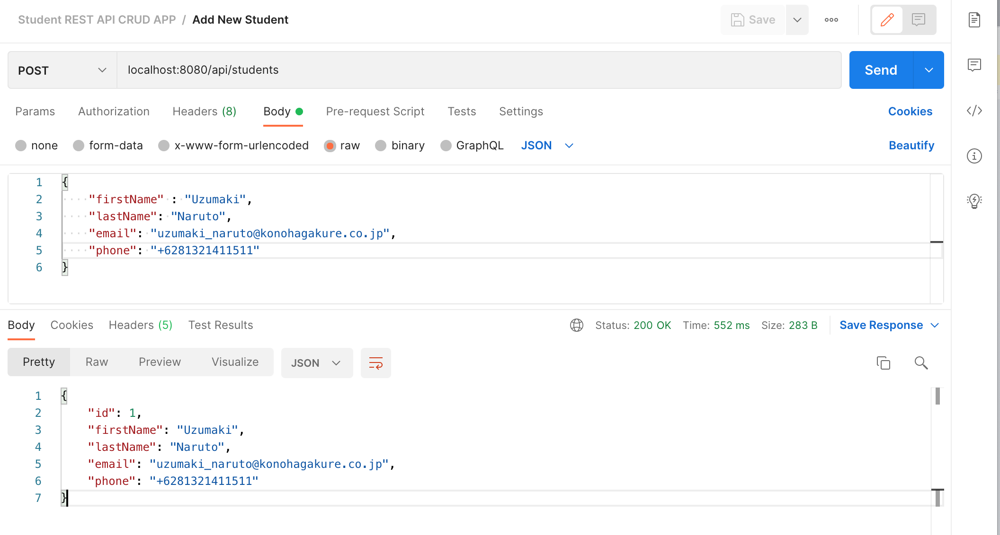
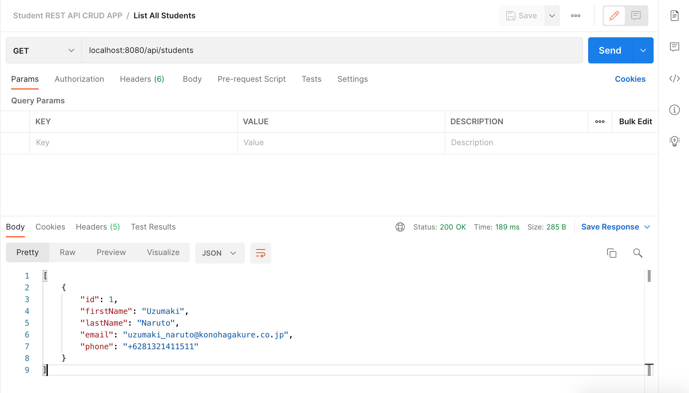
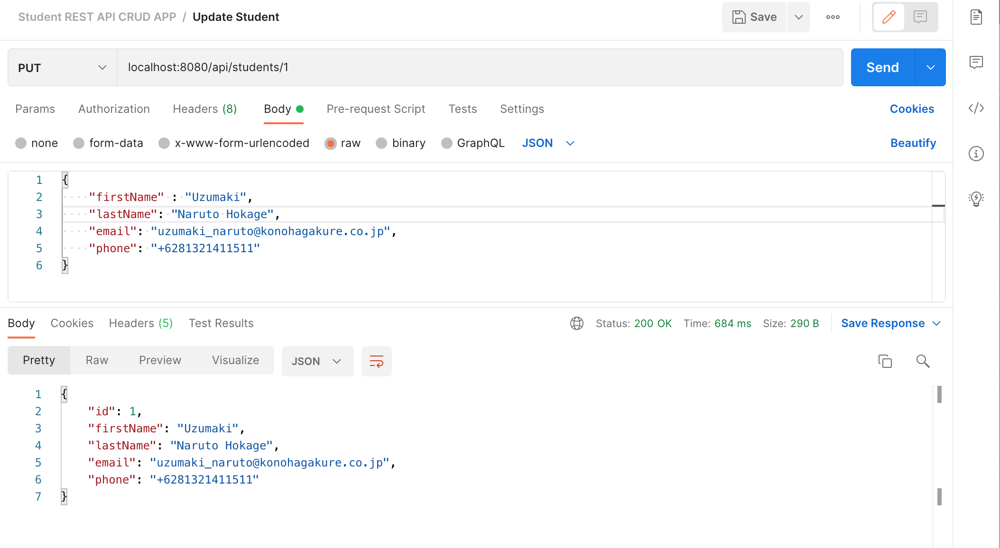
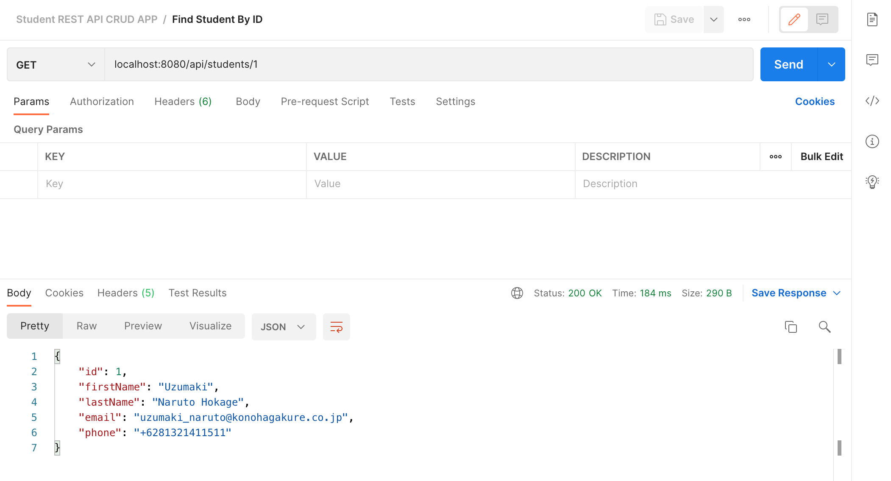
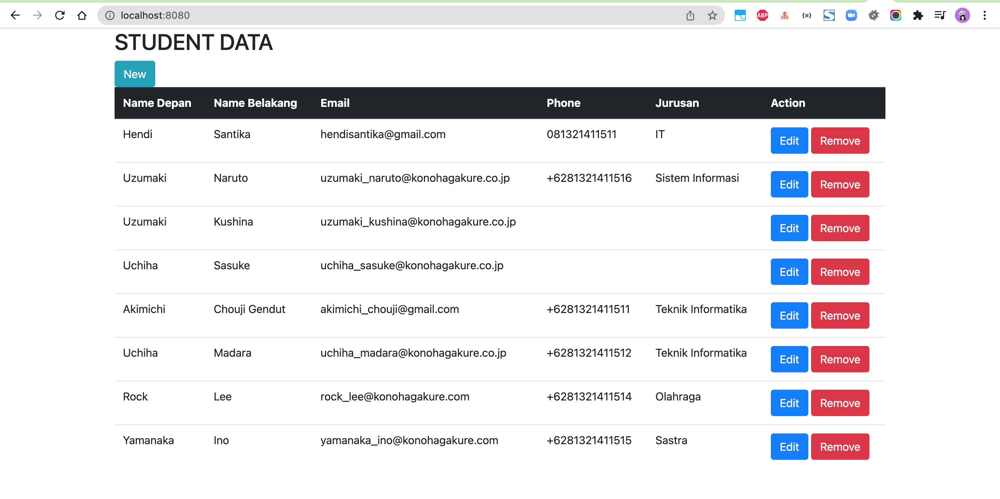
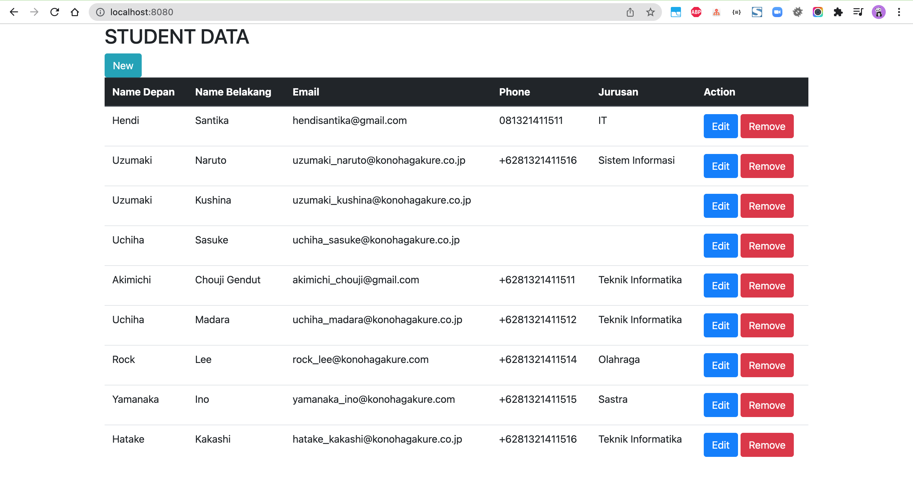
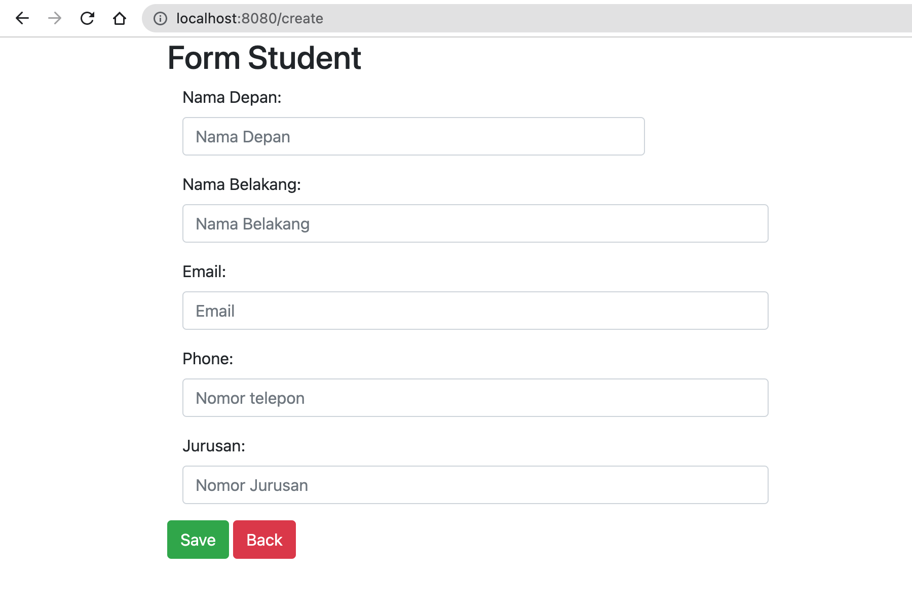
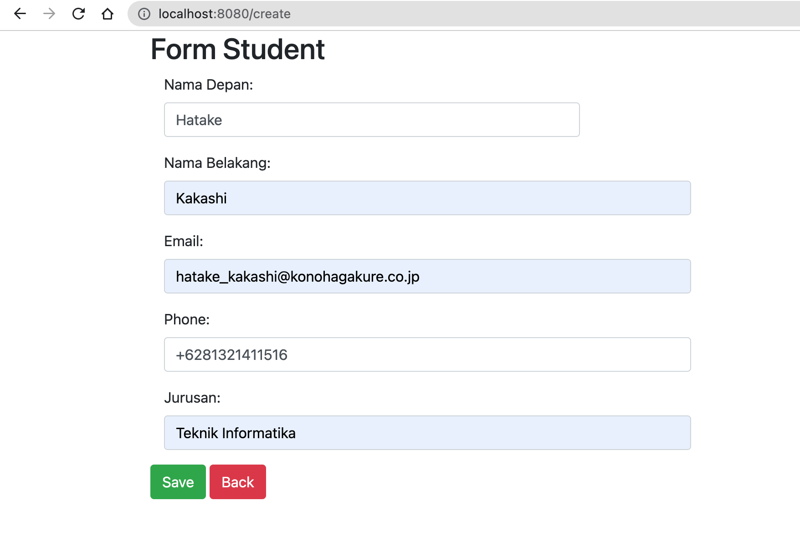
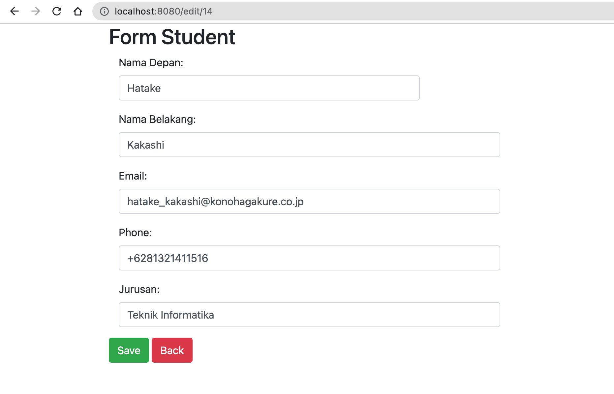

# student-crud-app

### Things todo list:

1. Clone this repository: `git clone https://github.com/hendisantika/student-crud-app.git`
2. Navigate to the folder: `cd student-crud-app`
3. Change your MySQL Credentials with your own in application.properties
4. Run the application: `mvn clean spring-boot:run`
5. Import the POSTMAN Collection.

### Image Screen shots

Add New Student




```shell
curl --location --request POST 'localhost:8080/api/students' \
--header 'Content-Type: application/json' \
--data-raw '{
    "firstName" : "Uzumaki",
    "lastName": "Naruto",
    "email": "uzumaki_naruto@konohagakure.co.jp",
    "phone": "+6281321411511"
}'
```

Get All Students



```shell
curl --location --request GET 'localhost:8080/api/students'
```

Update Student



```shell
curl --location --request PUT 'localhost:8080/api/students/1' \
--header 'Content-Type: application/json' \
--data-raw '{
    "firstName" : "Uzumaki",
    "lastName": "Naruto Hokage",
    "email": "uzumaki_naruto@konohagakure.co.jp",
    "phone": "+6281321411511"
}'
```

Find Student by ID



```shell
curl --location --request GET 'localhost:8080/api/students/1'
```

Delete Student


```shell
curl --location --request DELETE 'localhost:8080/api/students/4'
```

### Web Screen shot










